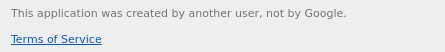

# apps-script-remove-warning

Webpages deployed via Google App Scripts now include an annoying message on top of an iframe.

Specifically this happens when the app is deployed for everyone (anonymous access on the web).

The message can be seen below:

And it reads:

> This application was created by another user, not by Google.
> 
> Terms of Service

This plugin removes that message for every script.google.com page that is accessed by the browser.

It waits for the warning to appear and sets display: none to it.

The warning can't be removed from within because the page is an iframe and your frame will not have external access to remove the message. Therefore, the plugin is required.

Great to add to your TVs and public displays running chrome. Beware, though, of course, that pages from scripts.google.com are not trustworthy. Clearly by installing this plugin you must be aware of that.